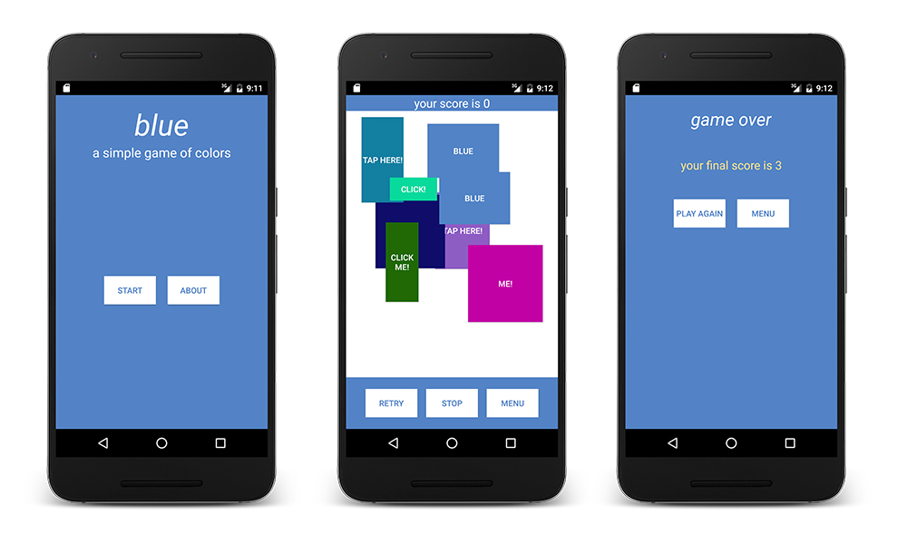

#  Blue: A simple game of colors

### What is Blue?

Blue is a dead-simple game that requires a good eye and speed. All the player needs to do is tap the BLUE buttons, and none of the other ones.

### How?

Refer to the `Blue Instructions.pdf` for instructions on how to play.

### Screenshot

### License

The file `LICENSE` in the repo.